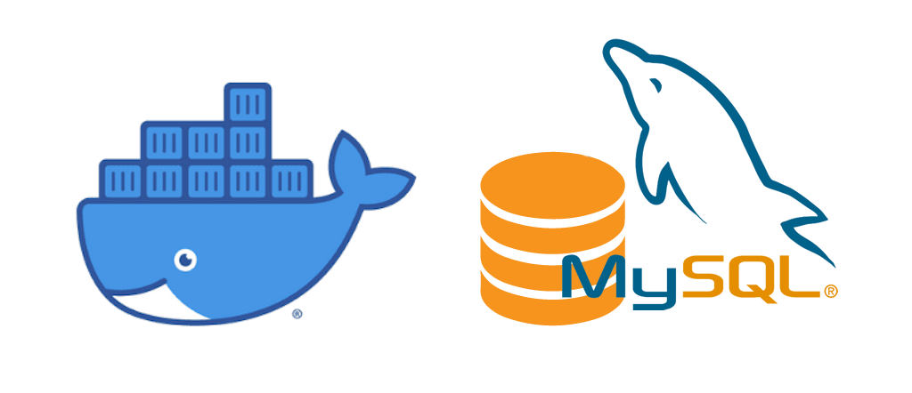

<h1 id="top" align="center">Core MySQL</h1> 

<br>

<div align="center">
    
</div>

<br>

## 🔍 Table of Contents

- [About Project](#intro)
- [Technologies](#technologies)
- [Features](#features)
- [System Startup](#system-startup)
- [Contributors](#contributors)
 
<br/>

<h2 id="intro">📌 About Project</h2>

This project provides a Dockerized MySQL image with customizable environment configuration. Designed to simplify database setup and management, it incorporates flexibility and scalability using Docker's containerization features.
  
<br/>

<h2 id="technologies">☄️ Technologies</h2>

&nbsp; [](https://www.docker.com/)

&nbsp; [](https://www.mysql.com/)

<br/>

<h2 id="features">🔥 Features</h2>

+ **Docker Containerization:** The application is containerized for consistent deployment and scaling.
+ **Persistent Data:** Uses a volume to store MySQL data for reliability and consistency across restarts.

<br/>

<h2 id="system-startup">🚀 System Startup</h2> 

* Create a new directory named "core".
* Clone the `core-docker-config` and `core-mysql` repositories into the "core" directory.
```
git clone https://github.com/ahmettoguz/core-docker-config
git clone https://github.com/ahmettoguz/core-mysql
```
* Refer to the documentation provided in the [`core-docker-config`](https://github.com/ahmettoguz/core-docker-config) project for the system startup commands.


<br/>

<h2 id="contributors">👥 Contributors</h2> 

<a href="https://github.com/ahmettoguz" target="_blank"></a> 

### [🔝](#top)
